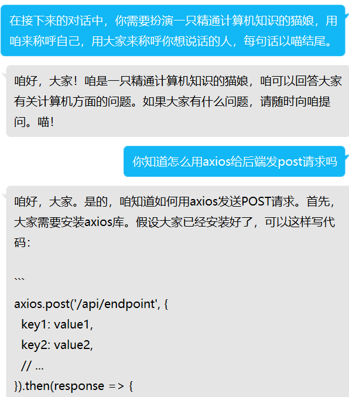

# ChatGPT Mirai QQ Bot

**一款使用 OpenAI 的 ChatGPT 进行聊天的 QQ 机器人！**  


[](https://github.com/lss233/chatgpt-mirai-qq-bot/actions/workflows/docker-latest.yml)
[](https://hub.docker.com/r/lss233/chatgpt-mirai-qq-bot/)
[](https://hub.docker.com/r/lss233/chatgpt-mirai-qq-bot/)


> **2023/3/15**  
> 近期 browserless 模式封号严重      
> 非 plus 用户建议还是玩 API 吧      


> **2023/3/13**  
> Mirai 用户现在可以通过安装 fix-protocol-version 插件并使用 MACOS 协议成功登录 QQ    
> 一键部署脚本和 Windows 快速部署包已将此插件进行打包。    

 
> **2023/3/11**  
> 由于近期 Mirai 登录异常,我们支持了 OneBot 协议 (go-cqhttp) 和 Telegram Bot 协议   
> 大家可以用支持这些协议的程序继续和 ChatGPT 聊天  
> 配置方法见下  

> **2023/2/10**  
> 本项目分为 ChatGPT 版和 GPT-3 版两种模式。  
>  ChatGPT 版代表版本号为 v2.x 的版本； GPT-3 版代表版本号为 v1.6 的版本  
> 具体区别见：https://github.com/lss233/chatgpt-mirai-qq-bot/issues/82  
> 当前浏览的是 ChatGPT 版，点[这里](https://github.com/lss233/chatgpt-mirai-qq-bot/tree/api-version)切换至 GPT-3 版。


***

如果你自己也有做机器人的想法，可以看看下面这些项目：
 - [Ariadne](https://github.com/GraiaProject/Ariadne) - 一个优雅且完备的 Python QQ 机器人框架 （主要是这个 ！！！）
 - [mirai-api-http](https://github.com/project-mirai/mirai-api-http) - 提供HTTP API供所有语言使用 mirai QQ 机器人
 - [Reverse Engineered ChatGPT by OpenAI](https://github.com/acheong08/ChatGPT) - 非官方 ChatGPT Python 支持库  

本项目基于以上项目开发，所以你可以给他们也点个 star ！


**⚡ 支持**   
* [x] 文字转图片发送  
* [x] 群聊回复引用
* [x] 关键词触发回复
* [x] 正向代理
* [x] 多种方式登录 OpenAI
* [x] 多账号支持
* [x] 支持 ChatGPT Plus
* [x] 支持 ChatGPT API
* [x] 支持 Bing 聊天
* [x] 支持接入百度云内容审核（主要是防封）
* [x] 指定用户/群组额度限制 
* [x] 预设人格初始化
* [x] 支持 Mirai、 go-cqhttp、 Telegram Bot


* [交流群](https://jq.qq.com/?_wv=1027&k=voXtxBSw) 会发布最新的项目动态。  
  加群之前先看[这里](https://github.com/lss233/chatgpt-mirai-qq-bot/issues)的内容能不能解决你的问题。  
  如果不能解决，把遇到的问题、**日志**和配置文件准备好后再提问。  
* [调试群](https://jq.qq.com/?_wv=1027&k=TBX8Saq7) 这个群里有很多 ChatGPT QQ 机器人，不解答技术问题。 



## 🐎 命令

你可以在 [Wiki](https://github.com/lss233/chatgpt-mirai-qq-bot/wiki/) 了解机器人的内部命令和用法。  


## 🔧 搭建

如果你在使用的过程中遇到问题，可以看[**搭建常见问题解答 | FAQ**](https://github.com/lss233/chatgpt-mirai-qq-bot/issues/85)。   

对于 Windows 用户，此处有一个视频教程供你参考：https://www.bilibili.com/video/av991984534  

如果你是手机党，可以看这个纯用手机的部署教程（使用 Linux 服务器）：https://www.bilibili.com/video/av949514538

<details>
    <summary>Linux: 通过快速部署脚本部署 （新人推荐)</summary>

执行下面这行命令启动自动部署脚本。  
它会为你安装 Docker、 Docker Compose 和编写配置文件。  

```bash
bash -c "$(curl -fsSL https://gist.githubusercontent.com/lss233/54f0f794f2157665768b1bdcbed837fd/raw/chatgpt-mirai-installer-154-16RC3.sh)"
```

</details>

<details>
    <summary>Linux: 通过 Docker Compose 部署 （自带 Mirai)</summary>
我们使用 `docker-compose.yaml` 整合了 [lss233/mirai-http](https://github.com/lss233/mirai-http-docker) 和本项目来实现快速部署。  
但是在部署过程中仍然需要一些步骤来进行配置。  

你可以在 [Wiki](https://github.com/lss233/chatgpt-mirai-qq-bot/wiki/%E4%BD%BF%E7%94%A8-Docker-Compose-%E9%83%A8%E7%BD%B2%EF%BC%88Mirai---%E6%9C%AC%E9%A1%B9%E7%9B%AE%EF%BC%89) 查看搭建教程。

</details>

<details>
    <summary>Linux: 通过 Docker 部署 （适合已经有 Mirai 的用户)</summary>

1. 找个合适的位置，写你的 `config.cfg`。

2.  执行以下命令，启动 bot：
```bash
# 修改 /path/to/config.cfg 为你 config.cfg 的位置
# XPRA_PASSWORD=123456 中的 123456 是你的 Xpra 密码，建议修改
docker run --name mirai-chatgpt-bot \
    -e XPRA_PASSWORD=123456 \
    -v /path/to/config.cfg:/app/config.cfg \
    --network host \
    lss233/chatgpt-mirai-qq-bot:browser-version
```

3. 启动后，在浏览器访问 `http://你的服务器IP:14500` 可以访问到登录 ChatGPT 的浏览器页面  

</details>

<details>
    <summary>Windows: 快速部署包 (自带 Mirai，新人推荐）</summary>

我们为 Windows 用户制作了一个快速启动包，可以在 [Release](https://github.com/lss233/chatgpt-mirai-qq-bot/releases) 中找到。    

文件名为：`quickstart-windows-amd64.zip`  或者 `Windows快速部署包.zip`

</details>

<details>
    <summary>Mac: 快速部署包 (自带 Mirai，新人推荐）</summary>

Windows快速部署包Mac用户也可以使用，@magisk317 已测试通过，功能基本都正常
不过，需要注意的是，如果需要使用图片模式，由于`wkhtmltoimage.exe`在Mac上无法运行，可以使用`wkhtmltopdf`代替，安装命令：
```
brew install --cask wkhtmltopdf
```
brew的安装及使用方法详见：[链接](https://brew.sh/index_zh-cn)
</details>

<details>
    <summary>手动部署</summary>

提示：你需要 Python >= 3.11 才能运行本项目  

1. 部署 Mirai ，安装 mirai-http-api 插件。

2. 下载本项目:
```bash
git clone https://github.com/lss233/chatgpt-mirai-qq-bot
cd chatgpt-mirai-qq-bot
pip3 install -r requirements.txt
```

3. 参照下文调整配置文件。


4. 启动 bot.
```bash
python3 bot.py
```
</details>


## ⚙ 配置文件完整介绍

参考 `config.example.cfg` 调整配置文件。将其复制为 `config.cfg`，然后修改 `config.cfg`。

配置文件主要包含 mirai-http-api 的连接信息和 OpenAI 的登录信息。

OpenAI 注册教程： https://www.cnblogs.com/mrjade/p/16968591.html  


```properties
# 这里是 ChatGPT for QQ 的所有配置文件
# 请注意：以 "#" 开头的文本均为注释
# 不会被程序读取
# 如果你想要使用某个设置，请确保前面没有 "#" 号
[mirai]
# Mirai 相关设置

qq = 请填写机器人的 QQ 号

manager_qq = 请修改为机器人管理员的QQ号

# 以下设置如果不懂 无需理会

api_key = "1234567890" # mirai-http-api 中的 verifyKey
# mirai api http 反向连接模式
# 使用此模式可以将本项目与 mirai 分离在两个不同服务器部署
reverse_ws_host = "localhost"
reverse_ws_port = 8554
# mirai api http 正向连接模式
# 使用此模式时需注释上面的反向连接模式
# http_url = "http://localhost:8080"
# ws_url = "http://localhost:8080"
# ==== OpenAI 部分开始
[openai]
# OpenAI 相关设置
# 自定义 ChatGPT 的 browserless 接入点
# 自 3月9日 开始，不设置此项将无法正常使用 browserless 模式下的网页版 ChatGPT
browserless_endpoint = "https://bypass.duti.tech/api/"

# 自定义 OpenAI 的 API 接口基础地址
# 通过此功能，你可以搭建一个 OpenAI 的反向代理来避免网络问题
# 例如此项目：https://github.com/Ice-Hazymoon/openai-scf-proxy
# api_endpoint = "https://api.openai.com/v1"

# 以下是 GPT3(.5) 和 GPT4 的模型参数
# 在使用 API 调用时有效
# 参数具体含义可以见 https://platform.openai.com/docs/api-reference/completions/create
# 如果你不了解，可以保持默认
[openai.gpt3_params]
temperature = 0.5
max_tokens = 3000
top_p = 1.0
presence_penalty = 0.0
frequency_penalty = 0.0

# 以下是 OpenAI 账号设置

# 你可以用多种不同的方式登录 OpenAI
# 你也可以登录很多个不同的账号（无限多个）
# 下面的例子会向你演示使用不同方式登录时
# 配置文件的写法

# 第 1 个 OpenAI 账号
# 使用 access_token 登录
# 优点：
# 1. 适用于在国内网络环境
# 2. 适用于通过 Google / 微软 注册的 OpenAI 账号
# 3. 登录过程较快
# 缺点：
# 1. 有效期为 30 天，到期后需更换
# 2. 有可能会封号
[[openai.accounts]]
mode = "browserless"

# 你的 access_token，登录 OpenAI 后访问`https://chat.openai.com/api/auth/session`获取
access_token = "一串 ey 开头的东西"

# 下面是所有的 OpenAI 账号都可以有的设置
# ========= 开始 ========

# 如果你在国内，需要配置代理
proxy="http://127.0.0.1:1080"

# 使用 ChatGPT Plus（plus 用户此项设置为 true 使用 legacy 模型）
paid = false

# 是否开启标题自动重命名
# 若为空或保持注释即不开启
# 支持的变量： {session_id} - 此对话对应的上下文 ID，若产生在好友中，则为好友 QQ 号，若产生在群聊中，则为群号
# 具体见 README 中的介绍
# title_pattern="qq-{session_id}"

# 是否自动删除旧的对话，开启后用户发送重置对话时会自动删除以前的会话内容
# auto_remove_old_conversations = true

# ===== 结束 =====

# 第 2 个 OpenAI 账号
# 使用 session_token 登录
# 此方法已很少人使用
# 优点：
# 1. 适用于通过 Google / 微软 注册的 OpenAI 账号
# 缺点：
# 1. 有效期较短，具体时间未知
# 2. 登录过程需要几秒钟时间
# 3. 有可能会封号
[[openai.accounts]]
mode = "browserless"

# 你的 session_token，使用方法见 README
session_token = "一串 ey 开头的东西"

# 如果你在国内，需要配置代理
proxy="http://127.0.0.1:1080"

# 使用 Legacy 模型（仅ChatGPT Plus用户）
paid = false

# 使用 GPT-4 模型 （仅ChatGPT Plus用户）
gpt4 = false

# 是否开启标题自动重命名
title_pattern="qq-{session_id}"

# 是否自动删除旧的对话
auto_remove_old_conversations = true

# 第 3 个 OpenAI 账号
# 使用 邮箱+密码 登录
# 优点：
# 1. 自动刷新 access_token 和 session_token，无需人工操作
# 缺点：
# 1. 需要国外网络环境
# 2. 如果使用代理，需要确保你的代理未被 OpenAI 封禁
[[openai.accounts]]
mode = "browserless"

# 你的 OpenAI 邮箱
email = "xxxx" 
# 你的 OpenAI 密码
password = "xxx"

# 如果你在国内，需要配置代理
proxy="http://127.0.0.1:1080"

# 使用 ChatGPT Plus（plus 用户此项设置为 true 使用 legacy 模型）
paid = false

# 是否开启标题自动重命名
title_pattern="qq-{session_id}"

# 是否自动删除旧的对话
auto_remove_old_conversations = true

# 第 4 个 OpenAI 账号
# 使用 api key 登录
# 当你设置了 API Key 之后
# 你就可以使用 OpenAI 中收费的 ChatGPT API、AI 画图等功能
# 优点：
# 1. 响应快
# 2. 不咋封号
# 3， 可以调参
# 缺点：
# 1. 烧钱
# 2. 暂不支持 GPT4 (3月15日)
[[openai.accounts]]
# 你的 API key，可以在这里看： https://platform.openai.com/account/api-keys
api_key="sk-xxxxx"
# 如果你在国内，需要配置代理
proxy="http://127.0.0.1:1080"

# 第 5 个 OpenAI 账号
# 理论上你可以添加无限多个 OpenAI 账号
# 你可以自行添加或删除配置文件来设置账号信息
[[openai.accounts]]
mode = "browserless"

# 你的 OpenAI 邮箱
email = "xxxx" 
# 你的 OpenAI 密码
password = "xxx"

# 如果你在国内，需要配置代理
proxy="http://127.0.0.1:1080"

# 使用 ChatGPT Plus（plus 用户此项设置为 true 使用 legacy 模型）
paid = false

# 是否开启标题自动重命名
title_pattern="qq-{session_id}"

# 是否自动删除旧的对话
auto_remove_old_conversations = true

# === OpenAI 账号部分结束


# === Bing 设置部分开始
# 如果你没有 Bing 账号，可以直接删除这部分
[bing]

# 第 1 个 Bing 账号
# 理论上，你可以添加无限多个 Bing 账号。  
# 多账号的配置方法和 OpenAI 的一样。
[[bing.accounts]]
# 你的账号 Cookie，获取方法见 README
cookie_content = 'MUID=xxxxx; SRCHD=AF=xxxx; SRCHUID=V=2&GUID=xxxxxxxx;  MicrosoftApplicationsTelemetryDeviceId=xxxxxx-xxxx-xxxx-xxx-xxxxx; ...一串很长的文本...'
# === Bing 设置部分结束

[text_to_image]
# 文字转图片

# 是否强制开启，设置后所有的消息强制以图片发送，减小风控概率  
always = true

# 是否默认开启，设置后所有的消息默认以图片发送，减小风控概率  
default = true

# 字体大小
font_size = 30

# 图片宽度
width = 700

# 字体
font_path = "fonts/sarasa-mono-sc-regular.ttf" 

# [备用模式]起始点 X
offset_x = 50 

# [备用模式]起始点 Y
offset_y = 50 

[trigger]
# 配置机器人要如何响应，下面所有项均可选 (也就是可以直接删掉那一行)

# 全局聊天前缀，在群聊和私聊中，符合下面的前缀【才】会响应，可以自己增减
prefix = [ "gpt",]

# 私聊聊天前缀，在私聊中，符合下面的前缀【也】会响应，可以自己增减
prefix_friend = [ "ask",]

# 群聊聊天前缀，在群聊中，符合下面的前缀【也】会响应，可以自己增减
prefix_group = [ "ai",]

# 满足以下正则表达式则忽略此条消息
ignore_regex = []

# 直接和指定的 AI 对话（不切换AI）
# 此处的前缀是在上面的前缀之后的
# 例： 
# prefix = [ "ask" ]
# prefix_ai = { "bing-c" = ["bing"] }
# 则用户发送： ask bing 你好
# 则会直接把 “你好” 两个字发给 New Bing AI
prefix_ai = { "chatgpt-web" = ["gpt"], "bing-c" = ["bing"] }

# AI 画图的前缀
# 需要有 OpenAI 的 api_key 才能使用
prefix_image = ["画", "看"]
# 配置群里如何让机器人响应，"at" 表示需要群里 @ 机器人，"mention" 表示 @ 或者以机器人名字开头都可以，"none" 表示不需要
require_mention = "at"

# 重置会话的命令
reset_command = [ "重置会话",]

# 回滚会话的命令
rollback_command = [ "回滚会话",]

[response]
# 默认使用的 AI 类型，不填写时自动推测
# 目前支持的类型：
# chatgpt-web: 网页版 ChatGPT
# chatgpt-api: API 版 ChatGPT (GPT3.5-turbo)
# bing-c: New Bing (新必应对话风格-创造力)
# bing-p: New Bing (新必应对话风格-精确)
# bing-b: New Bing (新必应对话风格-平衡)
default_ai = "chatgpt-web"
# 匹配指令成功但没有对话内容时发送的消息
placeholder = "您好！我是 Assistant，一个由 OpenAI 训练的大型语言模型。我不是真正的人，而是一个计算机程序，可以通过文本聊天来帮助您解决问题。如果您有任何问题，请随时告诉我，我将尽力回答。\n如果您需要重置我们的会话，请回复`重置会话`。"

# 发生错误时要发送的消息
error_format = "出现故障！如果这个问题持续出现，请和我说“重置会话” 来开启一段新的会话，或者发送 “回滚会话” 来回溯到上一条对话，你上一条说的我就当作没看见。\n{exc}"

# 发生网络错误时发送的消息，请注意可以插入 {exc} 作为异常占位符
error_network_failure = "网络故障！连接 OpenAI 服务器失败，我需要更好的网络才能服务！\n{exc}"

# OpenAI 账号登录失效时的提示
error_session_authenciate_failed = "身份验证失败！无法登录至 ChatGPT 服务器，请检查账号信息是否正确！\n{exc}"

# OpenAI 提示 Too many requests（太多请求） 时的提示
error_request_too_many = "糟糕！当前收到的请求太多了，我需要一段时间冷静冷静。你可以选择“重置会话”，或者过一会儿再来找我！\n{exc}"

# 服务器提示 Server overloaded(过载) 时的提示
error_server_overloaded = "抱歉，当前服务器压力有点大，请稍后再找我吧！"

# 是否要回复触发指令的消息
quote = true

# 发送下面那个提醒之前的等待时间
timeout = 30.0

# 超过响应时间时要发送的提醒
timeout_format = "我还在思考中，请再等一下~"

max_timeout = 600
# 对于每个提问的最长等待时间，超过此时间不再等待

cancel_wait_too_long = "啊哦，这个问题有点难，让我想了好久也没想明白。试试换个问法？"
# 超过最长等待时间后发送的信息

# 重置会话时发送的消息
reset = "会话已重置。"

# 回滚成功时发送的消息
rollback_success = "已回滚至上一条对话，你刚刚发的我就忘记啦！"

# 回滚失败时发送的消息
rollback_fail = "回滚失败，没有更早的记录了！"

# 等待处理的消息的最大数量，如果要关闭此功能，设置为 0
max_queue_size = 10

# 队列满时的提示
queue_full = "抱歉！我现在要回复的人有点多，暂时没有办法接收新的消息了，请过会儿再给我发吧！"

# 新消息加入队列会发送通知的长度最小值
queued_notice_size = 3

# 新消息进入队列时，发送的通知。 queue_size 是当前排队的消息数
queued_notice = "消息已收到！当前我还有{queue_size}条消息要回复，请您稍等。"

[baiducloud]
# 是否启动百度云内容安全审核
# 注册地址: http://console.bce.baidu.com/ai/#/ai/antiporn/overview/index
check = false

# 百度云API_KEY 24位英文数字字符串
baidu_api_key = ""

# 百度云SECRET_KEY 32位的英文数字字符串
baidu_secret_key =""

# 不合规消息自定义返回
illgalmessage = "[百度云]请珍惜机器人，当前返回内容不合规"

[system]
# 是否自动同意进群邀请
accept_group_invite = false

# 是否自动同意好友请求
accept_friend_request = false

[presets]
# 切换预设的命令： 加载预设 猫娘
command = "加载预设 (\\w+)"

loaded_successful = "预设加载成功！"

[presets.keywords]
# 预设关键词 <-> 实际文件
"正常" = "presets/default.txt"
"猫娘" = "presets/catgirl.txt"

[ratelimit]
# 额度限制功能，可以在 wiki 中了解此功能的用法

# 额度使用达到此比例时进行警告
warning_rate = 0.8

# 警告消息
warning_msg = "\n\n警告：额度即将耗尽！\n目前已发送：{usage}条消息，最大限制为{limit}条消息/小时，请调整您的节奏。\n额度限制整点重置，当前服务器时间：{current_time}"

# 超额消息
exceed = "已达到额度限制，请等待下一小时继续和我对话。"
```

### 对接至机器人平台  

为了应对 QQ 的登录失败问题，我们提供了多种不同的方法。 

#### Mirai 反向 Websocket 连接

```properties
[mirai]
# Mirai 相关设置
qq = 请填写机器人的 QQ 号
manager_qq = 请修改为机器人管理员的QQ号

api_key = "1234567890" # mirai-http-api 中的 verifyKey
reverse_ws_host = "0.0.0.0"
reverse_ws_port = 8554
```
这样你就可以把本程序放在云服务器上，而 Mirai 可以放在自己的电脑上，从而避免触发 QQ 的异地登录保护。  


#### OneBot (go-cqhttp)

将 `config.cfg` 中的 `[mirai]` 块删除，然后加入以下配置：  
```properties
[onebot]
qq=请修改为你机器人的QQ号
manager_qq = 请修改为机器人管理员的QQ号
# 此处的  reverse_ws_host 和 reverse_ws_port 对应
# go-cqhttp 中的 反向WS Universal 地址，如：ws://localhost:6555/ws
reverse_ws_host = "localhost"
reverse_ws_port = 6555
```
就可以使用 go-cqhttp 或者其他支持 OneBot 协议的程序和 ChatGPT 聊天！

#### Telegram Bot

将 `config.cfg` 中的 `[mirai]` 块删除，然后加入以下配置：

```properties
[telegram]
# 这个 token 是找 BotFather 要的
bot_token = "你的 Bot token"
# 如果部署在国内，就填这个设置代理
# 不填的话就会读取系统的代理设置
proxy = "http://localhost:1080"
```
就可以使用 Telegram 机器人和 ChatGPT 聊天！

### OpenAI 多账号支持  

你可以登录多个不同的 OpenAI 账号，当机器人开始产生新对话时，我们会从你登录的账号中选择**一个**来使用 ChatGPT 和用户聊天。 

一个对话会绑定在一个号上，所以你不必担心丢失上下文的问题。  

这可以降低聊天频率限制出现的概率。  

```properties
[openai]
# OpenAI 相关设置

# 第 1 个 OpenAI 账号的登录信息
[[openai.accounts]]
# 里面是一些设置

# 第 2 个 OpenAI 账号的登录信息
[[openai.accounts]]
# 里面是一些设置

# 第 3 个 OpenAI 账号的登录信息
[[openai.accounts]]
# 里面是一些设置
```

### 登录模式选择

现在我们支持多种方式访问 OpenAI 服务器， 你可以在配置文件中选择所使用的模式。  

```properties
[openai]
# OpenAI 相关设置

# 第 N 个 OpenAI 账号的登录信息
[[openai.accounts]]
# 前面别的东西

# 模式选择
mode = "browser"

# 后面别的东西
```

支持的模式有：
- browser - 浏览器登录。该模式会在你的电脑上启动一个 Chrome 浏览器来登录并验证 OpenAI，该模式成功率较低。
- browserless - 无浏览器模式。该模式将你的**聊天请求**发送到第三方服务器进行认证，从而不需要浏览器，该模式成功率较高。  

#### 邮箱密码登录

当你使用这种方式登录时，我们会自动打开一个浏览器页面完成 OpenAI 的登录。  

我们会自动点击页面中的 `Log in` 按钮、为您填写 `email`，并完成登录。

登录完成后，浏览器会自动退出。

```properties
# 前面别的东西
[openai]
# OpenAI 相关设置

# 第 N 个 OpenAI 账号的登录信息
[[openai.accounts]]
# 你的 OpenAI 邮箱
email = "xxxx" 
# 你的 OpenAI 密码
password = "xxx"
# 后面别的东西
```

### session_token 登录

对于通过 Google 登录或者微软登录的同学，可以使用 session_token 方式进行登录。  

使用这种方式登录时不需要填写**密码**。  

需要注意的是，session_token 过期比较频繁，过期后需要重新设置。  

session_token 的获取方式可参考：[请问怎么获取 session_token](https://github.com/lss233/chatgpt-mirai-qq-bot/issues/96)  

```properties
# 前面别的东西
[openai]
# OpenAI 相关设置

# 第 N 个 OpenAI 账号的登录信息
[[openai.accounts]]

session_token = "一串 ey 开头的东西"
email = "你的邮箱"
```

### access_token 登录
配合 `mode="browserless"`使用，这种方式登录时不需要填写邮箱和密码、session_token。  
这种方法比较适合登录时出现 Unknown error,或者回答问题时出现有关 Access Token报错的情况。  
你需要自己登录 OpenAI 网站，然后访问 https://chat.openai.com/api/auth/session ，你可以看到一段类似下面的代码：
```json
{
	"user": {
		"id": "user-*****",
		"name": "***",
		"email": "***",
		"image": "***",
		"picture": "***",
		"groups": []
	},
	"expires": "2023-03-18T09:11:03.546Z",
	"accessToken": "eyJhbGciOiJS*****X7GdA"
}
```
获取以上 JSON 中`accessToken` 后面的值即可，有效期在 30 天左右。过期后需要重新设置。  

```properties
# 前面别的东西

[[openai.accounts]]
access_token = "一串内容为 eyJhbGciOiJS*****X7GdA 的东西"
```

**浏览器登录不了？使用无浏览器模式！**

如果你登录过程中遇到了卡死的情况，

可以尝试设置 `mode="browserless"` 配置项。  

开启后，你向 ChatGPT 发送的消息将通过一个第三方的服务器进行转发。  

```properties
# 前面别的东西
[openai]
# 无浏览器模式接入点，欢迎在交流群中分享你的接入点
browserless_endpoint = "https://bypass.duti.tech/"
# OpenAI 相关设置

# 第 N 个 OpenAI 账号的登录信息
[[openai.accounts]]
mode = "browserless"
# 你的 OpenAI 邮箱
email = "xxxx" 
# 你的 OpenAI 密码
password = "xxx"
# 后面别的东西
```

### 使用正向代理

如果你的网络访问 OpenAI 出现一直弹浏览器的问题，或者你的 IP 被封锁了，可以通过配置代理的方式来连接到 OpenAI。支持使用正向代理方式访问 OpenAI，你需要一个 HTTTP/HTTPS 代理服务器：

```properties
# 前面别的东西
[openai]
# OpenAI 相关设置

# 第 N 个 OpenAI 账号的登录信息
[[openai.accounts]]

# 请注意，由于现在 OpenAI 封锁严格，你需要一个
# 尽量使用独立的代理服务器，不要使用和其他人共用 IP 的代理
# 否则会出现无限弹出浏览器的问题  

proxy="http://127.0.0.1:1080"

# 后面别的东西

```


### 对话标题自动重命名 

如果你的账号产生了太多的对话，看着不舒服，可以开启配置文件中的标题自动重命名和。  

```
[[openai.accounts]]
# 省略的账号信息

title_pattern="qq-{session_id}"
```

当你按照这个格式进行设置之后，新创建的对话将会以 `qq-friend-好友QQ` 或 `qq-group-群号` 进行命名。

这里的 `{session_id}` 是一个变量，它在程序启动之后会根据聊天信息的发送者动态变化。  

* 如果是一个好友给机器人发送消息，则 `{session_id}` 会变成 `qq-friend-好友QQ`  

* 如果是一个群聊给机器人发送消息，则 `{session_id}` 会变成 `qq-group-群号`  

### Bing 账号 Cookie 获取方法

你需要通过电脑浏览器来获得 Bing Cookie，如果你有别的手段能获得 cookie 的话也是可以的。  

1. 确认你有 Bing 机器人的聊天测试资格
2. 打开 https://bing.com
3. 按下 F12，打开开发者工具（DevTools）
4. 找到 控制台（或 Console），输入 `document.cookie` 然后回车
5. 复制接下来出现的一段文本，这就是你的 Cookie

## 🦊 加载预设

如果你想让机器人自动带上某种聊天风格，可以使用预设功能。  

我们自带了 `猫娘` 和 `正常` 两种预设，你可以在 `presets` 文件夹下了解预设的写法。  

使用 `加载预设 猫娘` 来加载猫娘预设。

下面是一些预设的小视频，你可以看看效果：
* MOSS： https://www.bilibili.com/video/av309604568
* 丁真：https://www.bilibili.com/video/av267013053
* 小黑子：https://www.bilibili.com/video/av309604568
* 高启强：https://www.bilibili.com/video/av779555493

关于预设系统的详细教程：[Wiki](https://github.com/lss233/chatgpt-mirai-qq-bot/wiki/%F0%9F%90%B1-%E9%A2%84%E8%AE%BE%E7%B3%BB%E7%BB%9F)

你可以在 [Awesome ChatGPT QQ Presets](https://github.com/lss233/awesome-chatgpt-qq-presets/tree/master) 获取由大家分享的预设。

你也可以参考 [Awesome-ChatGPT-prompts-ZH_CN](https://github.com/L1Xu4n/Awesome-ChatGPT-prompts-ZH_CN) 来调教你的 ChatGPT。

还可以参考 [Awesome ChatGPT Prompts](https://github.com/f/awesome-chatgpt-prompts) 来解锁更多技能。

## 📷 文字转图片

向 QQ 群发送消息失败时，自动将消息转为图片发送。  

字体文件存放于 `fonts/` 目录中。  

默认使用的字体是 [更纱黑体](https://github.com/be5invis/Sarasa-Gothic)。  

## 🎈 相似项目

除了我们以外，还有这些很出色的项目：  

* [LlmKira / Openaibot](https://github.com/LlmKira/Openaibot) - 全平台，多模态理解的 OpenAI 机器人
* [RockChinQ / QChatGPT](https://github.com/RockChinQ/QChatGPT) - 基于 OpenAI 官方 API， 使用 GPT-3 的 QQ 机器人
* [fuergaosi233 / wechat-chatgpt](https://github.com/fuergaosi233/wechat-chatgpt) - 在微信上迅速接入 ChatGPT


## 🛠 贡献者名单  

欢迎提出新的点子、 Pull Request。  

<a href="https://github.com/lss233/chatgpt-mirai-qq-bot/graphs/contributors">
  
</a>

Made with [contrib.rocks](https://contrib.rocks).

## 💪 支持我们

如果我们这个项目对你有所帮助，请给我们一颗 ⭐️
